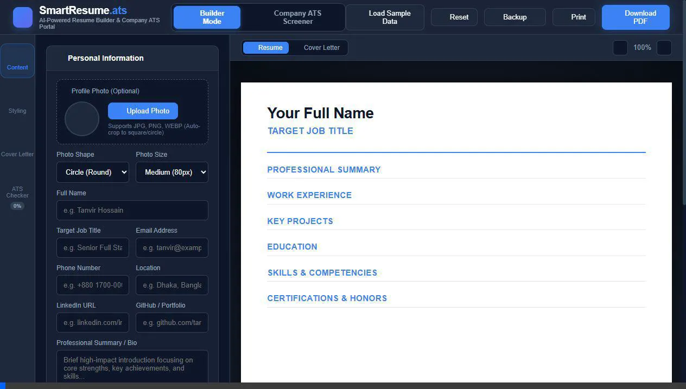

# 📄 Smart Resume Builder & ATS Keyword Optimizer


An open-source, AI-inspired **Smart Resume & CV Builder** featuring **Real-time ATS (Applicant Tracking System) Keyword Analysis**, instant **A4 PDF Export**, multi-template styling, and local data persistence.

Built for developers, job seekers, and students who want to build ATS-optimized resumes that pass automated recruiter filters.

---

## 🎬 Live Interactive Demo



> [!TIP]
> **Try both modes**: Switch seamlessly between **Candidate Resume Builder** and **Company ATS Candidate Screener** with real-time scoring, multi-location OR logic, age limit range filters, and hierarchical education matching.

---

## ✨ Features

- ⚡ **Dual-Mode System**:
  - 👤 **Builder Mode**: Interactive candidate resume & cover letter creator with live A4 preview.
  - 🏢 **Company ATS Screener Mode**: Recruiter portal to upload multiple candidate PDF resumes, enter Job Requirements, and rank applicants automatically.
- 🏢 **Bulk PDF Resume Screener**: Drag & drop or browse multiple PDF CVs at once. Built-in `pdf.js` extracts raw text, candidate email, and phone numbers.
- 🏆 **Candidate Leaderboard & Ranking**: Automatically scores and ranks candidates descending by ATS Match Score (%) with color-coded status badges (*Top Match*, *Potential*, *Low Match*).
- 📊 **Detailed Candidate Inspector & HR CSV Export**: Inspect individual candidate matched/missing skills, review extracted raw text, and export comprehensive CSV recruitment reports for HR teams.
- ✉️ **Cover Letter Builder & AI Auto-Draft**: Generate matching, professional cover letters with 1-click **AI Auto-Drafting** aligned with your job title and target company.
- ⚡ **AI High-Impact Action Verb Helper**: Clickable action verb chips (*Architected, Spearheaded, Optimized, Automated, Quantified*) for experience bullet points.
- 📸 **Profile Photo Support & Custom Shapes**: Upload an optional profile photo with custom shape options (**Circle**, **Rounded**, **Square**) and sizing controls (**Small 64px**, **Medium 80px**, **Large 96px**).
- 🎨 **Quick Color Theme Swatches & Presets**: Select from 8 vibrant instant theme presets (Ocean Blue, Emerald, Royal Purple, Crimson Red, Sunset Orange, Slate, Sky Blue, Teal) or pick a custom accent color HEX code.
- 🎯 **ATS Keyword Matching Engine**: Paste any target job description (JD) to get an immediate **Match Score (%)**, a breakdown of **Matched vs. Missing High-Impact Keywords**, and actionable formatting feedback.
- 📐 **Multi-Template & Custom Fonts**:
  - **Modern Tech**: Contemporary layout tailored for software engineers and digital creators.
  - **Executive Classic**: Clean, professional layout for corporate and managerial roles.
  - **Minimal Clean**: Ultra-sleek minimalist design focusing on content hierarchy.
  - Font Selector (Inter, Outfit, Lora, Roboto Mono).
- 💾 **Data Privacy & Backup**:
  - Auto-saves all changes to browser `localStorage`.
  - **Export / Import JSON**: Easily back up or share your resume data structure.
  - **Preloaded Sample Data**: Single-click demo data loader for rapid testing (supports 5 demo candidate CVs for recruiters).
- 🖨️ **1-Click Print & Direct PDF Download**: Direct PDF export via `html2pdf.js` or browser print fallback with `@media print` CSS optimization for exact A4 paper size downloads without UI clutter.

---

## 🚀 Quick Start / How to Run Locally

Because Smart Resume Builder is built with pure web technologies (HTML, CSS, JavaScript), no node package installation or build process is required!

### Option 1: Direct File Open
1. Clone or download this repository:
   ```bash
   git clone https://github.com/your-username/smart-resume-builder.git
   ```
2. Open `index.html` in your favorite browser.

### Option 2: Run via Local Server (Recommended)
Using Python:
```bash
python -m http.server 8080
```
Then open `http://localhost:8080` in your web browser.

---

## 📤 How to Deploy to GitHub Pages

1. Push this repository to your GitHub account:
   ```bash
   git init
   git add .
   git commit -m "Initial commit - Smart Resume Builder"
   git branch -M main
   git remote add origin https://github.com/your-username/smart-resume-builder.git
   git push -u origin main
   ```
2. On GitHub, navigate to **Settings > Pages**.
3. Under **Branch**, select `main` and click **Save**.
4. Your website will be live at `https://your-username.github.io/smart-resume-builder/` in minutes!

---

## 💡 How the ATS Score Engine Works

The ATS engine extracts tokens from your target job description, filters out English stop words, and compares them against your resume content:
- **Keyword Match (%)**: `(Matched Keywords / Total JD Terms) * 100`
- **Action Verbs Check**: Detects impact verbs such as *Architected*, *Optimized*, *Scaled*, *Reduced*.
- **Metrics Detector**: Checks if your experience bullets include quantifiable achievements (% increases, user scale, latency reductions).

---

## 📜 License

This project is open source and available under the [MIT License](LICENSE).
